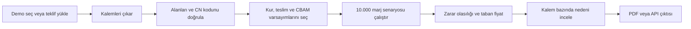
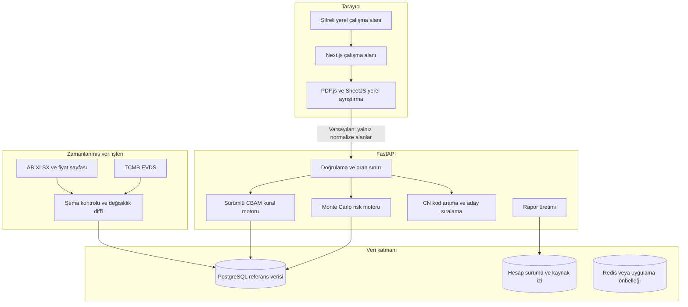
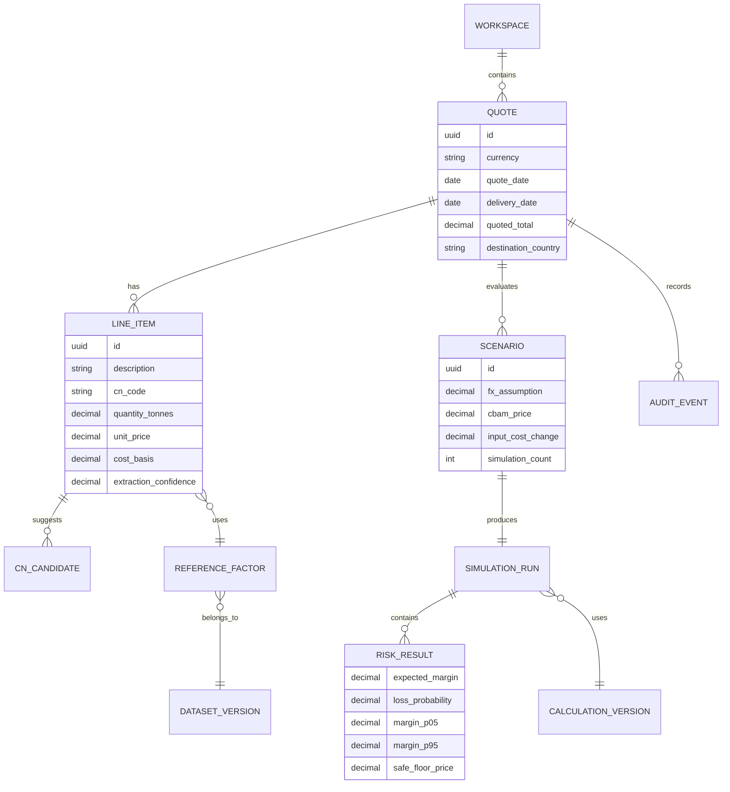

# Marj: fizibilite, ürün şeması ve geliştirme planı

Tarih: 30 Eylül 2026

## Karar

Proje teknik olarak yapılabilir ve portföy değeri yüksektir. Doğrudan bir “CBAM uyumluluk yazılımı” olarak pazara girmek mantıklı değildir; bu alan 2026 itibarıyla kalabalıklaşmıştır. CBAMbridge, Dubrink, CarbonChain, CBAM Data ve benzeri ürünler hesaplama, belge toplama, raporlama ve senaryo analizi sunuyor.

Savunulabilir ürün açısı şudur:

> Marj, Türkiye'den AB'ye satış yapan üreticiler için gizlilik odaklı teklif risk çalışma alanıdır. Teklif/BOM verisinden teslim tarihindeki marj dağılımını hesaplar; kur, girdi maliyeti ve CBAM etkisini aynı senaryoda birleştirir. Resmî beyan hazırlamaz ve hukuki uygunluk iddiasında bulunmaz.

Bu konumlandırma ürünü CBAM hesap makinelerinden ayırır. Kullanıcının sorusu “kaç sertifika gerekir?” değil, “bu fiyatla teklif verirsem teslim tarihinde para kazanır mıyım?” olur.

## Fizibilite puanı

| Boyut | Puan | Gerekçe |
|---|---:|---|
| Portföy ve işe alım etkisi | 9/10 | Belge işleme, veri mühendisliği, deterministik hesap, olasılıksal model, API, güvenlik ve ürün tasarımını tek projede gösterir. |
| Teknik yapılabilirlik | 8/10 | MVP için gereken bileşenler olgun açık kaynak araçlarla kurulabilir. |
| Resmî veri erişimi | 7/10 | CBAM tabloları ve fiyatları yayımlanıyor; bazı kaynaklar API yerine XLSX/HTML olduğu için sürümlü ETL gerekir. |
| Model yapılabilirliği | 7/10 | Kur belirsizliği modellenebilir. CBAM fiyat geçmişi kısa olduğu için burada tahmin modeli değil senaryo dağılımı kullanılmalıdır. |
| İlk kullanıcıya ulaşma | 5/10 | Teklif ve maliyet verisi hassastır. Yerel çalışma ve sentetik demo bu engeli azaltır. |
| Doğrudan startup fırsatı | 6/10 | Pazar var ama rakipli. Türkiye odaklı teklif kararı ve gizlilik farklılaşması doğrulanmalıdır. |
| Hukuki/domain riski | 5/10 | Yanlış CN kodu veya emisyon varsayımı sonucu etkiler. İnsan onayı ve kaynak izi zorunludur. |

Karar: Portföy projesi olarak **GO**. Ticari ürün kararı için iki alan uzmanı ve beş hedef kullanıcıyla problem görüşmesi yapılmadan abonelik veya uyumluluk özelliği geliştirilmemeli.

## Resmî veri tabanı

- Avrupa Komisyonu, CBAM kesin dönemini 1 Ocak 2026'da başlattı. Kapsam çimento, demir-çelik, alüminyum, gübre, elektrik ve hidrojeni içeriyor: <https://taxation-customs.ec.europa.eu/carbon-border-adjustment-mechanism/cbam-definitive-regime_en>
- Varsayılan değerler ve benchmark dosyaları sürümlü XLSX olarak yayımlanıyor: <https://taxation-customs.ec.europa.eu/carbon-border-adjustment-mechanism/cbam-legislation-and-guidance_en>
- Komisyon 2026'da sertifika fiyatlarını üç aylık yayımlıyor. Q1 fiyatı 75,36 EUR, Q2 fiyatı 75,28 EUR olarak yayımlandı: <https://taxation-customs.ec.europa.eu/carbon-border-adjustment-mechanism/price-cbam-certificates_en>
- TCMB EVDS, EUR/TRY ve ilgili ekonomik seriler için web servis sunuyor: <https://evds2.tcmb.gov.tr/help/videos/EVDS_Web_Service_Usage_Guide.pdf>
- AB, doldurulmuş sektör şablonları ve iletişim örnekleri yayımlıyor. Bunlar gerçek müşteri belgesi olmadan test fixture üretmek için kullanılabilir: <https://taxation-customs.ec.europa.eu/carbon-border-adjustment-mechanism/cbam-communication-and-news_en>

Önemli sınır: CBAM Registry herkese açık bir “beyan gönderme API'si” gibi ele alınmamalı. MVP, resmî portala beyan göndermeyecek. Her hesap kaynak URL'si, veri sürümü ve hesaplama adımlarıyla gösterilecek.

## Rakip analizi ve ürün boşluğu

2026 pazarında dört ana ürün ailesi bulunuyor:

1. Beyan ve XML hazırlayan CBAM ürünleri
2. Tedarikçiden emisyon verisi toplayan platformlar
3. Gümrük/ERP içinden CBAM kalemlerini çıkaran sistemler
4. Başka yazılımlara CBAM hesabı sağlayan API'ler

CBAMbridge Türkiye ve MENA üreticilerini de hedefliyor; eşik takibi, belge kasası, yükümlülük hesabı ve ETS senaryoları sunuyor. Bu nedenle “CBAM dashboard + belge yükleme” tek başına farklı bir ürün değildir: <https://www.cbambridge.com/>

Marj'ın ayrışacağı noktalar:

- AB ithalatçısının beyan süreci yerine Türk ihracatçının teklif kararına odaklanır.
- Teklif fiyatı, kur, BOM maliyeti, teslim tarihi ve CBAM etkisini aynı marj dağılımında birleştirir.
- Dosya yüklemeyi zorunlu tutmaz; elle giriş, yerel ayrıştırma ve sentetik demo sunar.
- Tek rakam yerine dağılım, güven aralığı ve zarar olasılığı verir.
- Her sonucun kaynağını ve hesaplama sürümünü gösterir.
- Kullanıcıya “uyumlusun” demez; hangi varsayımın fiyat kararını değiştirdiğini gösterir.

## Hedef kullanıcı

İlk persona: Yılda birkaç kez AB'ye demir-çelik veya alüminyum ürünü satan, tekliflerini Excel ile hazırlayan 20-250 çalışanlı üretici.

Birincil kullanıcı: ihracat satış müdürü veya finans sorumlusu.

İkincil kullanıcı: dış ticaret danışmanı, mali müşavir veya sürdürülebilirlik danışmanı.

Temel iş: Bir RFQ geldiğinde, teklif geçerlilik ve teslim süresi boyunca marjı koruyacak satış fiyatını belirlemek.

## MVP kapsamı

MVP'de olacaklar:

- Sentetik örnekle tek tık demo
- XLSX/CSV içe aktarma
- Metin tabanlı PDF'den teklif satırı çıkarma
- Kalemleri elle düzeltme
- CN kodu arama ve ilk üç aday önerisi
- Kullanıcı onaylı ürün kodu
- Güncel resmî CBAM referans verisi
- Günlük EUR/TRY verisi
- Kur için tarihsel blok bootstrap veya quantile model
- CBAM fiyatı ve girdi maliyeti için kullanıcı kontrollü senaryolar
- Monte Carlo marj dağılımı
- Zarar olasılığı, beklenen marj ve güvenli taban fiyat
- Maliyet katkı waterfall'ı ve kalem tablosu
- Varsayımlar, kaynaklar ve hesap sürümü
- PDF/CSV sonuç dışa aktarımı
- Dokümante edilmiş REST API

MVP dışında bırakılacaklar:

- CBAM Registry'ye otomatik beyan
- “Mevzuata tam uyum” garantisi
- Doğrulanmış gerçek emisyon belgesi üretimi
- ERP/SAP entegrasyonu
- Çok şirketli ekip ve rol yönetimi
- Fatura saklama veya belge kasası
- Gerçek zamanlı EU ETS alım-satım verisi
- Eğitilmiş bir karbon fiyatı tahmin modeli

## Kullanıcı akışı



## Sistem mimarisi



Gizlilik varsayılanı: Metin tabanlı PDF ve Excel tarayıcıda ayrıştırılır. Backend'e ham belge yerine normalize edilmiş satırlar gönderilir. Taranmış PDF OCR'ı sonraki aşamada açık rıza ile geçici işlem olarak eklenebilir.

## Veri modeli



Portföy demosunda kullanıcı hesabı zorunlu olmayacak. Sunucu tarafında kalıcı QUOTE ve LINE_ITEM tabloları ancak kullanıcı açıkça “buluta kaydet” özelliğini seçerse devreye girecek.

## Model ve hesaplama yaklaşımı

### Belge çıkarımı

- XLSX/CSV için şema tespiti ve kolon eşleme
- Metin PDF için PDF.js/pdfplumber tabanlı çıkarım
- Satır birleştirme ve para/miktar normalizasyonu
- Her alan için güven skoru
- Düşük güvenli alanların kullanıcıya gösterilmesi

İlk sürümde özel OCR modeli eğitilmeyecek. Gerçek hata örnekleri birikmeden özel model eğitmek gösterişli fakat ölçülemez bir iş olur.

### CN kodu önerisi

- Resmî CN açıklamalarında lexical arama
- Çok dilli embedding ile semantik aday üretimi
- Kural tabanlı sektör filtresi
- İlk üç aday ve açıklama
- Kullanıcı onayı olmadan hesapta kullanılmama

Başarı metriği: top-1 ve top-3 doğruluk. Sentetik örneklerin yanında elle etiketlenmiş en az 100 ürün açıklaması gerekir.

### Kur riski

- TCMB EUR/TRY günlük serisi
- Tarihsel blok bootstrap ile otokorelasyonu koruyan senaryolar
- Alternatif olarak quantile regression
- Teslim ufkuna göre P05/P50/P95 kur dağılımı

Başarı metriği: yön tahmini değil, tahmin aralığı kapsamı ve pinball loss.

### CBAM fiyatı

2026'da yalnız üç aylık resmî fiyatlar bulunduğundan geçmiş veri kısa. Bu veriyle “AI karbon fiyat tahmini” yapılmayacak. Kullanıcı düşük, baz ve yüksek senaryo tanımlayacak; motor sonuç duyarlılığını gösterecek. Yeterli lisanslı EU ETS geçmişi eklenirse ayrı model değerlendirilebilir.

### Marj simülasyonu

Her senaryoda:

1. Satış tutarı ortak para birimine çevrilir.
2. BOM ve üretim maliyeti güncellenir.
3. Ürün koduna bağlı CBAM kapsamı ve referans faktörü uygulanır.
4. Karbon ve kur maliyeti hesaplanır.
5. Marj elde edilir.
6. Dağılımdan zarar olasılığı ve güvenli taban fiyat çıkarılır.

Regülasyon hesabı deterministik, belirsizlik modeli olasılıksal olacak. Arayüz bu ikisini ayrı etiketleyecek.

## API taslağı

```text
POST /v1/import/preview
POST /v1/cn-codes/suggest
GET  /v1/reference-data/status
POST /v1/quotes/analyze
POST /v1/scenarios/run
GET  /v1/runs/{run_id}
GET  /v1/runs/{run_id}/explain
POST /v1/reports/pdf
GET  /v1/methodology
```

`/v1/quotes/analyze` her sonuçla birlikte `dataset_version`, `calculation_version`, kaynak bağlantıları ve uyarılar döndürecek. OpenAPI şeması repoda yayınlanacak.

## Arayüz yönü

İlk ekran pazarlama sayfası olmayacak. Kullanıcı doğrudan çalışma alanını görecek ve sentetik bir teklif üzerinde sistemi deneyebilecek.

Ana ekran bileşenleri:

- Teklif başlığı ve teslim bilgisi
- Beklenen marj, zarar olasılığı ve güvenli taban fiyat
- Teslim tarihine kadar marj fan grafiği
- Kur, CBAM ve girdi maliyeti senaryo kontrolleri
- Teklif kalemleri ve veri güveni
- Maliyet katkı grafiği
- Kaynaklar ve hesap sürümü
- Yerel mod/bulut modu göstergesi

Görsel dil:

- Yoğun fakat sakin B2B çalışma alanı
- Beyaz/koyu nötr yüzeyler; yeşil yalnız güvenli sonuç, amber risk, kırmızı hata için
- Büyük hero, gradient, dekoratif kart yığını ve “AI-powered” etiketi yok
- Mobilde analiz okunabilir; asıl düzenleme akışı masaüstü öncelikli
- Klavye erişimi, görünür odak, tablo başlıkları ve grafik açıklamaları

`no-ai-slop` deposu bir UI kütüphanesi değil, yazı düzenleme sistemi. Onun somutluk, aktif dil, kaynak gösterme, şişirilmiş iddiaları kesme ve her cümlenin iş yapması ilkeleri ürün metnine, README'ye ve LinkedIn paylaşımına uygulanacak: <https://github.com/petergyang/no-ai-slop>

## Gizlilik ve güvenlik

- Hesapsız demo ve yerel çalışma alanı
- Ham belgenin varsayılan olarak tarayıcıdan çıkmaması
- Sunucu loglarında teklif satırı ve fiyat bulunmaması
- Hassas alanların istemcide maskelenmesi
- İsteğe bağlı bulut kaydında alan bazlı şifreleme
- Kısa ömürlü erişim tokenları
- Dosya işleme eklenirse tek kullanımlık imzalı URL ve kesin silme işi
- Bağımlılık ve secret taraması
- Veri dışa aktarma ve çalışma alanı silme
- “Hukuki/mali tavsiye değildir” uyarısı
- Her sonuçta kullanılan varsayımlar ve veri tarihi

## Test ve değerlendirme

| Katman | Test |
|---|---|
| Kural motoru | Komisyonun çalışılmış örnekleriyle golden test |
| Veri ETL | Şema değişikliği, checksum ve satır sayısı alarmı |
| Belge çıkarımı | Alan bazında precision/recall/F1 |
| CN önerisi | Top-1 ve top-3 doğruluk |
| Kur modeli | Rolling backtest, pinball loss, interval coverage |
| Simülasyon | Sabit seed ve property-based test |
| API | OpenAPI contract ve yük testi |
| Arayüz | Playwright masaüstü/mobil, erişilebilirlik ve görsel regresyon |
| Güvenlik | Dosya tipi, boyut, prompt/veri enjeksiyonu ve log sızıntısı testi |

## Geliştirme aşamaları

### Aşama 0: ürün doğrulama

- Bir ihracat satışçısı ve bir dış ticaret/CBAM danışmanıyla iki kısa görüşme
- Üç örnek teklif formatı
- MVP karar metriklerinin onayı
- “Bunu Excel'den neden daha iyi kullanırım?” sorusunun cevabı

### Aşama 1: çalışan dikey dilim

- Sentetik teklif
- Elle düzenlenen satırlar
- Sabit referans verisi
- Tek senaryo hesabı
- İlk analiz ekranı

### Aşama 2: veri ve kural motoru

- AB veri ingest işleri
- TCMB EVDS entegrasyonu
- Sürümleme ve değişiklik diff'i
- Golden testler

### Aşama 3: belge ve kod önerisi

- XLSX/CSV
- Metin PDF
- CN kod adayları
- İnsan doğrulama akışı

### Aşama 4: risk modeli

- Kur senaryoları
- Monte Carlo
- Güven aralığı ve taban fiyat
- Backtest raporu

### Aşama 5: ürün kalitesi

- Yerel veri modu
- PDF/CSV rapor
- API dokümantasyonu
- Türkçe/İngilizce arayüz
- Hata, boş ve yüklenme durumları

### Aşama 6: yayın

- Docker geliştirme ortamı
- GitHub Actions lint, test ve build
- Önizleme ortamı
- Üretim deploy
- Sentry benzeri hata takibi, hassas veri filtreli
- Demo veri ve 90 saniyelik ürün videosu

Tek geliştirici için kaliteli MVP yaklaşık 5-7 haftalık iş paketidir. Kod üretimi hızlanabilir; domain doğrulaması, test fixture'ları ve model değerlendirmesi atlanmamalı.

## Teknoloji seçimi

- Web: Next.js, TypeScript, TanStack Query, React Hook Form, Zod
- Stil: Tailwind veya sade CSS tokenları; Lucide ikonları
- Grafik: D3 veya ECharts
- API: FastAPI, Pydantic, SQLAlchemy
- Analiz: pandas/polars, NumPy, scikit-learn, statsmodels
- PDF/XLSX: PDF.js, pdfplumber, SheetJS/openpyxl
- Veri: PostgreSQL; yerel çalışma için IndexedDB veya SQLite WASM
- İşler: basit zamanlanmış worker; ölçek gerekirse Redis tabanlı kuyruk
- Test: pytest, Vitest, Playwright, axe
- Paketleme: Docker ve docker-compose

LLM temel bağımlılık olmayacak. Açıklama özelliği eklenirse hesap sonucunu değiştiremeyecek ve kaynak gösteren yapılandırılmış girdiden metin üretecek.

## Deploy kararı

Portföy sürümü:

- Frontend: Vercel veya Cloudflare Pages
- API/worker: Railway, Render veya Fly.io üzerinde Docker
- PostgreSQL: yönetilen Postgres
- Zamanlanmış veri işi: GitHub Actions veya backend cron
- Ham belge depolama: yok
- Alan adı: ürün son ismi belirlendikten sonra

İlk canlı sürümün maliyeti düşük tutulabilir. Ücretli OCR, LLM veya piyasa verisi kullanılmadığı sürece ana maliyet küçük bir API containerı ve veritabanıdır.

Deploy sırasında kullanıcıdan gerekebilecek tek şey, seçilen platform hesaplarının ve varsa alan adının yetkilendirilmesidir. Kod, test, CI, Docker, veri işleri, arayüz ve yayın akışı proje kapsamında yürütülebilir.

## Go/no-go kapıları

Proje aşağıdaki koşullarda devam eder:

- En az bir alan uzmanı hesap mantığındaki kritik varsayımları doğrular.
- Beş hedef kullanıcıdan en az üçü “teklif vermeden önce kullanırdım” der.
- CN önerisi test setinde top-3 doğruluk en az %90 olur.
- Golden hesap testlerinin tamamı geçer.
- Sentetik demoda kullanıcı üç dakika içinde sonuç alır.
- Ham belgenin sunucuya gitmediği tarayıcı ağ kaydıyla gösterilebilir.

Ticari ürün fikri şu durumda durdurulur veya yeniden konumlandırılır:

- Kullanıcılar marj hesabını değil yalnız resmî beyan çıktısını istiyorsa
- Gerekli emisyon verisini hiçbir üretici sağlayamıyorsa
- Danışman doğrulaması olmadan hesap güvenilir seviyeye gelemiyorsa
- Rakiplerin teklif kararı özelliği aynı gizlilik modeliyle standart hâle geldiyse

## LinkedIn ve görüşme çıktıları

Repo yalnız çalışan uygulamayı değil karar kalitesini göstermeli:

- Problem ve hedef kullanıcı
- Rakip araştırması ve neden kapsamın daraltıldığı
- Sistem mimarisi
- Veri sözlüğü ve kaynak sürümleri
- Model kartı ve backtest
- Kural motoru golden testleri
- Gizlilik tehdit modeli
- API dokümantasyonu
- Gerçekçi sentetik demo
- Bilinen sınırlamalar

Paylaşımın ana cümlesi:

> AB'ye ihracat yapan bir üreticinin bugün verdiği teklif, teslim tarihinde kur ve karbon maliyeti yüzünden zarara dönebilir. Marj, teklif satırlarını okuyup bu riski tek rakam yerine olasılık dağılımıyla gösteriyor; ham belge varsayılan olarak cihazdan çıkmıyor.

Bu açıklama projeyi mevzuat uzmanlığı iddiasına sokmadan veri bilimi, mühendislik ve ürün düşüncesini gösterir.
